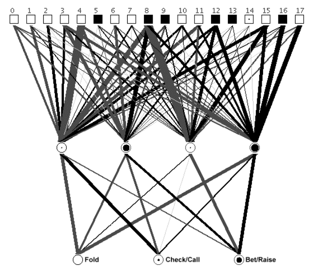
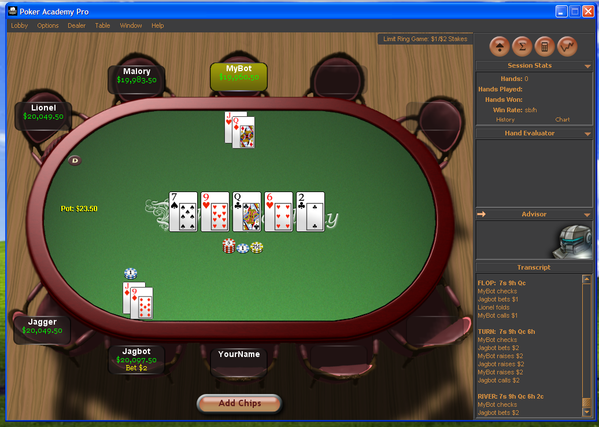

<!--
Feladatkiírás/Címoldal/Tartalomjegyzék/Nyilatkozat
Bevezetés                               1
A póker szabályai                       4
A számítógépes póker összefoglalása     3
Opponent Modeling                       10
Ágens megvalósítása
A felhasznált keretrendszer             4
Ágens architektúrája                    4
Ellenfélmodellezés megvalósítása        4
Gépi tanulás használata                 (2-3)
Featurek a játék állapotáról            (2-3)
Döntéshozás                             4
MCTS algoritmus                         (4)
Eredmények értékelése                   5
Irodalom                                1
Függelék
-->


<!-- titlepage as inline LaTeX-->

\begin{titlepage}
\begin{center}
\includegraphics[width=60mm,keepaspectratio]{figures/BMElogo.png}\\
\vspace{0.3cm}
\textbf{Budapesti Műszaki és Gazdaságtudományi Egyetem}\\
\textmd{Villamosmérnöki és Informatikai Kar}\\
\textmd{Méréstechnikai és Információs Rendszerek tanszék}\\[5cm]

\vspace{0.4cm}
{\huge \bfseries Számítógépes póker intelligens ágensekkel}\\[0.8cm]
\vspace{0.5cm}
\textsc{\Large Szakdolgozat}\\[4cm]

\begin{tabular}{cc}
 \makebox[7cm]{\emph{Készítette}} & \makebox[7cm]{\emph{Konzulens}} \\
 \makebox[7cm]{Sőre András} & \makebox[7cm]{Dr. Dobrowiecki Tadeusz doc.}
\end{tabular}

\vfill
{\large \today}
\end{center}
\end{titlepage}

<!-- end titlepage-->


<!-- acknowledgement as inline LaTeX-->

\thispagestyle{empty}

\begin{center}
\large
\textsc{Hallgatói Nyilatkozat}\\
\end{center}

Alulírott \emph{Sőre András}, szigorló hallgató kijelentem, hogy ezt a
szakdolgozatot meg nem engedett segítség nélkül, saját magam készítettem, csak
a megadott forrásokat (szakirodalom, eszközök stb.) használtam fel. Minden
olyan részt, melyet szó szerint, vagy azonos értelemben, de átfogalmazva más
forrásból átvettem, egyértelműen, a forrás megadásával megjelöltem.

Hozzájárulok, hogy a jelen munkám alapadatait (szerző(k), cím, angol és magyar
nyelvű tartalmi kivonat, készítés éve, konzulens(ek) neve) a BME VIK
nyilvánosan hozzáférhető elektronikus formában, a munka teljes szövegét pedig
az egyetem belső hálózatán keresztül (vagy autentikált felhasználók számára)
közzétegye. Kijelentem, hogy a benyújtott munka és annak elektronikus verziója
megegyezik. Dékáni engedéllyel titkosított diplomatervek esetén a dolgozat
szövege csak 3 év eltelte után válik hozzáférhetővé.

\begin{flushleft}
\vspace*{1cm}
Budapest, \today
\end{flushleft}

\begin{flushright}
 \vspace*{1cm}
 \makebox[7cm]{\rule{6cm}{.4pt}}\\
 \makebox[7cm]{\emph{Sőre András}}\\
 \makebox[7cm]{hallgató}
\end{flushright}

\vfill
\setcounter{page}{0}
\newpage

<!-- end of acknowledgement-->


\setcounter{tocdepth}{1}
\newgeometry{top=2.5cm,bottom=2.5cm, left=4cm, right=3cm}
\tableofcontents
\restoregeometry


Kivonat/Abstract {-}
================

A számítógépes póker a mesterséges intelligencia egy régóta kutatott területe.
A játék tulajdonságai alkalmassá teszik arra, hogy számos algoritmust és
módszert lehessen vizsgálni ellenőrzött, reprodukálható körülmények között.

A munkám során felkutattam a számítógépes póker eddigi eredményeit, majd ezek
alapján megterveztem egy egyszerű ágenst, ami gépi tanulást alkalmaz az
ellenfél modellezésére, és egy szimulációs módszert használ a döntéseinek
meghozatalára.

Az elkészült ágenst teszteltem más, meglévő játékosokkal a PokerAcademy nevű
keretrendszerben.

Abstract {-}
--------

Computer poker is a widely researched field of artificial intelligence. Because
of it's properties, it is used as a testbed for creating new algorithms in a
controlled environment.

During my work I researched existing papers about computer poker, then I
applied them to design my own computer poker player. My bot uses a machine
learning based opponent modelling method and a simulation based method for
making decisions.

I benchmarked the finished bot with other existing bots in the PokerAcademy
simulator program.


Bevezetés
=========

<!-- 1 oldal -->
Régebben hobbiszinten én is pókereztem internetes pókertermekben, így
felkeltette az érdeklődésemet, hogy ezt a játékot számítógép is játszhatja,
ráadásul sokszor hatékonyabban, mint profi emberi játékosok. Annak ellenére,
hogy a témakörben már rengeteg kutatást végeztek, egy pókerágens tervezése és
fejlesztése még mindig egy összetett feladat, rengeteg megoldandó problémával.

A terület egyik legnagyobb művelője a kanadai University of Albertán működő
Computer Poker Research Group (CRPG)[@CPRGHome97:online], akik már a
kilencvenes évek közepétől foglalkoznak a témával, és rengeteg eredményt
publikáltak. A kutatáson kívül versenyeket is szerveznek, ahol számítógépes
pókerágensek mérhetik össze tudásukat: a leghíresebb az Annual Computer Poker
Competition[@Home44:online], amelyet 2006-ban tartottak először, és évente
szervezik, különböző kategóriákban.

Az évek során számos ágenst fejlesztettek ki. A kezdeti próbálkozásokhoz képest
mára ott tartunk, hogy a CRPG "megoldotta" az általam is választott
pókerfajtát, azaz a legújabb játékosuk már gyakorlatilag tökéletesen játszik
[@CepheusP8:online]. Az általuk készített ágensek forrása nem nyílt, viszont
vázlatos képet kaphatunk a működésükről.

A saját munkám során a vizsgált pókerfajta és a tesztkörnyezet kiválasztása
után olyan megoldásra törekedtem, ami felhasználja a gépi tanulást valamilyen
formában, valamint elég egyszerű ahhoz, hogy a félév során működőképes ágens
legyen az eredmény. Ennek megfelelően a korábban önálló labormunka keretében
tervezett ágens architektúráját használtam fel, ahol az ellenfél viselkedésének
modellezését egy neurális háló végzi, valamint az ágens döntéseit a viszonylag
egyszerű MCTS algoritmus segítségével állítom elő.

A dolgozat elején bemutatom a pókerjátékot, valamint az általam választott
pókerfajtát, a Limit Texas hold'emet, kitérve annak a számítógépes póker
szempontjából lényeges aspektusaira. Utána magát a számítógépes pókert, mint
területet mutatom be, a fontosabb tulajdonságaira, megoldadó kérdésekre kitérve.
Külön szót ejtek még az ellenfél modellezésének kérdéseiről, valamint a
meglévő megoldásokról aszerint, hogy hogyan tudnak az egyes részproblémákra
választ adni.

Ezek után a saját ágensem architektúráját fogom ismertetni, a rendszerterven
kívül a megvalósítás részleteivel együtt, kitérve az ellenfélmodellezésre és a
döntéshozásra is.

Végül bemutatom, és értékelem az eredményeket, és megvizsgálom, hogy milyen
lehetőségek vannak a további fejlesztésekre.


A pókerjáték
============

A pókernek számos fajtája létezik[@PokerWik95:online]. Ezek elég különbözőek
lehetnek, de a közös vonás mindegyikben, hogy a játékosok egy kör során
valahány saját lapot kapnak, és a licitkör(ök) után a legjobb lapkombinációval
(kézzel) rendelkező játékos viszi el a tétet.

A kezek a játékosok saját, privát lapjaiból, illetve a leosztott, mindenki
által látható közös lapokból állhatnak. A játékfajták több mindenben
különbözhetnek, a teljesség igénye nélkül:

  - Licitkörök száma: ezekből több is lehet. Közöttük általában a játékosok
    lapokat cserélnek, vagy közös lapokat oszt le az osztó.

  - Licitek határa: bizonyos játékokban meg van szabva az emelés maximuma. A
    *fix limit*es játékokban az emelés fix összeg lehet csak.

  - Játékosok saját lapjainak száma, illetve a mindenki által látható közös
    lapok száma: vannak játékfajták, ahol nincsenek egyáltalán közös lapok.
    Valahol a játékosok lapjainak egy része látható az ellenfelek számára.

  - Lapok cseréjének lehetősége, a cserék száma: nem mindegyik fajtában lehet a
    privát lapokat kicserélni, valamelyikben viszont többször is.

  - A győztes játékosnak a legjobb, vagy a legrosszabb kézzel kell
    rendelkeznie: A hi/lo játékokban mindkettő kéz nyer, és feleződik a
    nyeremény.


A Texas hold'em
---------------

A számítógépes pókerben a leginkább vizsgált pókerfajta a Texas hold'em. A
játék e változata nagy népszerűségre tett szert a 2000-es évek elején, a
televíziónak és az internetnek köszönhetően. Ekkoriban terjedtek el az
internetes pókertermek is, ahol főleg ezt a változatot játszották.

A hagyományos 5 lapos pókerhez képest a játék elején minden játékos 2 saját,
privát lapot kap. Az osztó *(button)* utáni játékos *(kisvak/small blind)* az
alaptét felét teszi meg, és az utána következő játékos *(nagyvak/big blind)* az
alaptétet teszi meg kötelezően, így ösztönözve a további liciteket.

A Texas hold'em alfajai különböznek a licitekre vonatkozó megkötésekben. A
legnépszerűbb fajta, amit emberi játékosok játszanak, az a *no-limit*, azaz
limit nélküli hold'em, ahol a tét minimuma van csak megszabva, ami az adott
nagyvak, maximuma pedig a játékos összes zsetonja. További fajták még a *pot
limit* és a *fixed limit* hold'em. Az előbbinél a tét maximuma a jelenlegi
tétek összessége, a *pot* lehet, míg az utóbbinál a tét egy fix összeg.
Ez megegyezik a nagyvakkal (ami a nevezéktant illeti; a játékosokat és a
téteket is vakoknak hívják).

Az első licitkör után az osztó leosztja a közös lapok egy részét. Ezt *flop*
nak hívják, és 3 közös lapot jelent. Az újabb licitelés után rendre leosztásra
kerülnek a *turn* és *river* lapok, ezek 1-1 lapot jelentenek körönként.

Az utolsó licitkör után a bent maradó játékosok terítik a privát lapjaikat.
A játékosok kezei a leosztott lapokból és a saját, privát lapjaikból állnak. Az
így rendelkezésre álló 7 lapból alkotott legjobb 5 lapos kombináció fog
számítani. A lapok mutatását _showdownnak_ hívják.

A játékot játszhatják *cash game* vagy verseny formában. Az előbbinél a játékos
célja az asztalhoz leülve minél több zsetont megszerezni valahány kör során. A
játékos szabadon hozhat további zsetonokat az asztalhoz, és bármelyik kör után
szabadon távozhat a nyereményével.

A versenyek során viszont a versenyző játékosok fix mennyiségű zsetont kapnak,
és kieséssel távoznak az asztaltól. Az első néhány helyezés megegyezés szerint
részesül a nyereményből.

Én cash game-t használtam az ágens tesztkörnyezetének, és a munka során
feltettem továbbá, hogy minden játékosnak végtelen sok zsetonja van. Így egy
lejátszott játék eredménye közvetlenül mérhető volt, és nem kellett a stratégia
kidolgozása során figyelembe venni a zsetonok mennyiségét, ami pélául egy
verseny során fontos tényező.


Fixed Limit Texas hold'em
-------------------------

A Texas hold'em általam választott alfajtája a fixed limit Texas hold'em lett.
Mivel a no-limites és a pot-limites változattal ellentétben az emelés összege
mindig ugyanaz, a játékos 4 féle cselekvést végezhet alapvetően:

- Bedobja a lapjait *(fold)*
- Jelzi, hogy nem szeretne emelni, de nem kell tétet megadnia: *check*el
- Megadja az előtte levő emelést, ha volt *(call)*
- Emel az előre meghatározott fix összeggel *(bet/raise)*

A többi fajtában az emelés összegét variálhatja a játékos. Ez megnehezíti az
ágensek készítését a játékhoz, mivel a lehetséges lépések száma sokkal nagyobb.
Általában vödrökbe szokták kategorizálni az emelések mennyiségét, és az egy
kategóriába tartozóakat egy fajtának veszik [@gilpin2008heads].


Hold'em vs. 5 lapos póker
-------------------------

A fentiek alapján látható, hogy ennél a pókerfajtánál a játékosnak sokkal több
információ áll rendelkezésére a döntéshez, mint a klasszikus 5 lapos pókernél,
ahol nincsenek közös lapok, és így sokkal kevésbé tudunk következtetni az
ellenfél esélyeire a miénkkel szemben.

Ezért a Texas hold'em-ben sokkal komplexebb stratégiákat lehet alkalmazni a
másik nevezett pókerfajtához képest. Több könyv is íródott, ami a Texas hold'em
stratégiáit tárgyalja. Ezek könnyen alkalmazható heurisztikákkal látják el a
játékosokat[@sklansky1999theory]. Az emberi játékosok számára készített
stratégiákat felhasználják szakértői rendszerek készítésénél is, erről majd a
későbbi fejezetekben lesz szó.

### Egy példajáték

A stratégiák komplexitását úgy lehet a legjobban szemléltetni, ha megnézzük egy
konkrét játékbeli döntés meghozatalát egy átlagos emberi játékos szemével:

Képzeljük el, hogy versenyen ülünk egy asztalnál, középső pozícióban^[A játékos
asztalnál elfoglalt helyének "jósága". Ez gyakorlatilag azt jelenti, hogy
hányadik a játékos a körben.], és 10.000 zsetonunk van. Korai pozícióból^[Az
először cselekvő játékosok egyike.] ránk emelnek 600 zsetont. Nemrég ültünk az
asztalhoz, és nem ismerjük az ellenfelet, de tudjuk, hogy 20.000 zsetonja van.
Nálunk $\heartsuit Q, \clubsuit Q$ van.

A korai pozícióból történő emelés sok tartalék zsetonnal majdnem mindig az erős
lap jele. Meg lehetne adni, de akkor lehet, hogy az utánunk levő játékosok ránk
emelnének. A $\heartsuit Q, \clubsuit Q$-t pedig egy játékos ellen érdemes
kijátszani, és jobb a pozíciónk, mint az előttünk levőnek (megfigyelhetjük a
döntéseit).

Az ellenfél lehetséges lapjait valamennyire be tudjuk határolni. A kézből
pár az egyik lehetőség, körülbelül $88$-tól felfele. Az ász-magaslap is
esélyes lehet, az $AQ$, vagy $AK$. Az $AJ$ már kevésbé, mert az már gyengébbnek
számít.
A vakok 100-200 zsetonosak. Egy nagyobb emelést érdemes tenni, háromszorosát a
korábbi emelésnek: így elijesztjük a mögöttünk levő játékosokat, és megtudjuk,
hogy esetleg egy nagyobb pár van-e az előttünk levő emelőnél ($KK$ vagy $AA$).


A póker, mint kutatási terület
------------------------------
<!-- TODO: póker vs. sakk stb?-->

A játékoknak általában tisztán definiált szabályaik és céljaik vannak. A
legtöbb játéknak, ahol a játékos képességei számítanak a szerencsével
ellentétben, egyszerű a játékmenete, viszont komplex stratégiák kidolgozását
teszik lehetővé. Eredmények tekintetében ezek miatt könnyű összemérni két
játékos teljesítményét is, ezért összehasonlíthatóvá válnak a különböző gépi
játékosok.

A póker, mint játék, több mozzanatában különbözik a többi gyakran kutatott
játéktól (pl. sakk).

### Nem-tökéletes információ
<!--
- imperfect: nem ismert minden esemény, ami történik a játékban (pl. _inicializáció_)
- incomplete: a játék **szerkezete** nem ismert, pl hasznosságfüggvények, célok
-->

Nem-tökéletes információjú játéknak azt nevezik, amikor a játékosok nem tudnak
mindig a játékban történt eseményekről[@Perfecti13:online]. A ha a póker
játékfájába^[A játékfa egy irányított gráf, ahol a csúcsok a játék állapotai,
és az élek a játékosok lépései] belevesszük a lapok leosztását, mint
eseményeket, akkor mondhatjuk, hogy mindegyik játékos csak a saját lapjainak
leosztásáról értesül.

A pókerben a hiányzó információk szerepe nagyon fontos, ellentétben pl a
Scrabble-lel, ahol az ellenfél betűit nem ismerjük, viszont a gyakorlatban nem
befolyásolja nagyban a játékosok stratégiáit[@billings1995computer].


### Nemdeterminisztikus kimenetel

Általánosságban mondhatjuk, hogy egy játékhoz annál nehezebb játékost készíteni
a mesterséges intelligencia segítségével, minél nagyobb a lehetséges
játékállapotok száma, és ezzel a játékfa mérete.

A nemdeterminisztikus elemek egy játékban úgy növelik a játékfát, hogy közben a
hagyományos keresőalgoritmusok keresési terét nehéz lesz csökkenteni, így az
alkalmazhatóságuk is kérdéses lesz ilyen esetekben[@billings1995computer].


A számítógépes póker
====================

A játékot játszó hatékony mesterséges intelligenciának az alábbi
tulajdonságokkal kell rendelkeznie a sikeres játék érdekében [@davidson2002opponent, ch. 3]:


* Kéz értékelése: A lapjaink jelenlegi erősségét a közös lapok, valamint az
  ellenfél lehetséges lapjai határozzák meg. A játékban a legerősebb kézre van
  szükségünk a győzelemhez, ezért ennek a becslése fontos feladat egy ágens
  számára.

* Kiszámíthatatlanság: A cselekvéseinknek nem szabad elárulnia a kezünk
  erősségét. Játék közben *blöffölnünk*, *slow-playt*^[A blöff egy formája,
  ahol kevesebbet emelünk, mint ami a lapunk alapján várható lenne], vagy
  *check-raise-t*^[Egy emelési stratégia, amikor is egy check után az ellenfél
  emel, majd mi visszaemelünk] kell használnunk. Fontos, hogy ne ugyanazt a
  stratégiát használjuk mindig egy adott szituációban, hogy elrejtsük a
  kézerősségünket.

* Ellenfélmodellezés: Meg kell értenünk, hogy hogyan játszik egy ellenfél, hogy
  kihasználjuk a gyengeségeit, és védekezni is tudjunk ellene. Ehhez tudnunk
  kell értelmezni a cselekvéseit, hogy következtethessünk a kézerősségére és a
  további cselekvéseire. A kézerősség becslése nagyban függ attól, hogy hogyan
  tudjuk az ellenfél lapjainak eloszlását megbecsülni, azaz hogy milyen
  lapokkal hajlamos játszani.

Ezek a tulajdonságok iránymutatóként szolgálnak egy pókerágens tervezésénél.
Azt viszont már nekünk kell eldöntenünk, hogy ezeket az információkat pontosan
hogyan állítjuk elő és használjuk fel. Nem is biztos, hogy egy ágens
működése során explicit módon megjelennek ezek a fogalmak, viszont mindeképp
számolni kell velük.

Kéz értékelése
--------------

A kezek értékeléséhez több heurisztika és egyszerűsítés is rendelkezésünkre
áll [@billings1998poker]. Ezeknek még a későbbi ágensek bemutatása során is
szerepük lesz.

### Kezdőkezek csoportosítása

A kezdőkezek a Texas hold'emben 2 laposak, de ezeket 169 ekvivalens osztályra
tudjuk csoportosítani, a következő módon:

$$13 * pár + \binom{13}{2} * suited + \binom{13}{2} * offsuit$$

Itt a _suited_ azt jelenti, hogy a két lap egy színű, az _offsuit_ pedig azt,
hogy eltérő. Erősség szempontjából a konkrét színek nem számítanak, mivel az
elején még nem ismerjük a közös lapokat.

A kezdőkezek rangsorolását David Slansky is elvégzi tapasztalati alapon a
Theory of Poker című könyvében [@sklansky1999theory], viszont kísérleti úton is
előállítottak egy ilyen rangsort: a kézosztályok mindegyikével 1.000.000
játékot játszottak véletlenszerű ellenfelek ellen [@billings1998poker] olyan
módon, hogy minden ellenfél megad egyszer, és utána a játék végéig check-elnek.
Az eredmény egy rangsor lett, ami korrelál a könyvben megadottal. Az ászpár
nyert a legtöbbször, és a kettes-hetes _offsuit_ lett a legrosszabb.

A kezekhez csoportonként hozzárendeltek továbbá egy _bevételi rátát_, aminek a
mértékegysége a pókerben egyébként is használatos $nagyvak/100\_játszott\_kéz$.
Ennek a továbbiakban lesz jelentősége. A bevételi ráta jelenti, hogy az adott
kéz a kísérletek során mekkora bevételt ért el átlagosan. Például 2 nagyvak per
100 játszott kéz azt jelenti, hogy 100 játék alatt 200 nagyvaknyi nyereségre
tettünk szert.

### Kézerősség

Ez egy metrika, amit a flop után lehet alkalmazni, hogy megbecsüljük a kezünk
erősségét a többi játékoshoz képest[@billings1998opponent]. Ellenfélmodellezés
nélkül egyszerűen megszámoljuk a nálunk jobb, rosszabb és ugyanolyan kezeket.
Flop esetén pl $\binom{47}{2} = 1081$ lehetséges kéz lehet egy ellenfélnél^[A
nálunk levő kettőt és a 3 db. leosztott lapot ismerjük: 52 - 5 db. lap
ismeretlen].
Több ellenfél esetén egyszerűen hatványozzuk a kapott értéket az ellenfelek
számával.

### Kézpotenciál

Kíváncsiak lehetünk arra, hogy milyen esélyünk van, hogy javul a kezünk a flop
után, ahogy leosztanak még közös lapokat. A kézpontenciál megmondja, hogy
mekkora eséllyel javul a lapunk, úgy, hogy összeszámolja, hogy hány esetben
történhet ez meg (a kézpotenciáltmég pozitív potenciálnak is hívják).

Ehhez meg kell nézni egy ellenfél lehetséges lapjait: a flopon  pl. 990 * 1081
lehetséges kombinációt kell végignéznünk, mert 990 féle turn és river
kombináció lehetséges. Bizonyos kezeknek (ha már ismerjük a flopot) sokkal
nagyobb esélyük van a javulásra, pl a sorhúzóknak^[Olyan kéz, ami 1 lap híján
sort alkot] és a flösshúzóknak^[Olyan kéz, ami egy lap híján flösst alkot].

A negatív potenciál az előbbivel analóg módon annak az esélyét adja meg, hogy
egy kéz a leosztott lapok hatására gyengébbnek számít. Például nálunk
$\heartsuit K, \clubsuit A$ van, és a flopon az alábbi lapokat kapjuk:
$\spadesuit 5, \spadesuit 6, \spadesuit 7$. Itt az összes ellenfélnél levő, és
további közös káró lap, vagy négyes, és nyolcas rontja az esélyeinket.


### EHS

Az egyszerűség kedvéért jó, ha van egy érték, ami kifejezi az erősséget a
potenciállal együtt. Annak a valószínűségét akarjuk, hogy nálunk lesz a legjobb
kéz, miután leosztották az utolsó lapot is. Ezt hívjuk _effektív kézerősségnek_
(effective hand strength, EHS) [@davidson2002opponent, ch. 3.3].

$$ EHS = HS * (1 - NPot) + (1 - HS) * PPot $$

A képletben levő $HS$ a kézerősségnek felel meg, az $NPot$ és a $PPot$ pedig
rendre a pozitív és negatív potenciált jelenti. A gyakorlatban viszont
kiveszik a negatív potenciált, és az alábbi képletet használják:

$$ EHS = HS + (1 - HS) * PPot $$

Elsőre ez nem tűnik magától értődőnek. A magyarázat erre az, hogy ha magas a
negatív potenciál, akkor valószinűleg amúgy is emelnénk, így kényszerítve az
ellenfelet, hogy be kelljen fektetnie a következő lapig^[Az ellenfél keze
javulhatna annak ellenére, hogy nem kell megfontolnia, hogy folytassa a kört.].


### Pot Odds

Egy másik, lazán kapcsolódó fogalom még a _pot odds_, ami kifejezi egy darab
érték formájában, hogy a befektetendő pénzhez mennyit nyerhetünk vissza. Ezt
sok helyzetben felhasználhatják az emberi, illetve a gépi játékosok is.

  $$pot\_odds = \frac{megadandó\_zsetonok}{megadandó\_zsetonok + pot}$$

A megadandó zsetonok azt jelenti, hogy a játékosnak mennyi zsetont kell
megadnia az előtte történt emelések miatt.

Ellenfélmodellezés
------------------

Ahogy korábban elhangzott, az ellenfélmodellezés két fő célja az ellenfél
cselekvéseinek és kézerősségének megbecslése.

Az ellenfélmodellezést megnehezítő tényezők [@davidson2002opponent, ch. 4]:

- Bizonytalanság: A nagy számú ismeretlen kártya megnehezíti a felhasználható
  információk kinyerését. Minden játék teljsen más lehet, mint az előző, ezért
  sok megfigyelésre van szükségünk, mielőtt azonosítunk egy tendenciát.

- Hiányzó információ: Csak akkor látjuk az ellenfél lapjait, ha eljut a
  showdownig, ráadásul ezek a lapok csak a megjátszott kezeinek csak egy
  részhalmaza.

- Ismeretlen változók: Egy játékos döntéseit ismeretlen számú változó
  befolyásolja, és a játékosok különböző tényezőket vehetnek figyelembe játék
  közben. Például amíg az asztalnál elfoglalt pozíció fontos lehet egy
  játékosnak, addig egy másiknak kevésbé. A játékot meghatározó tényezők
  megválasztása nem feltétlenül racionális módon történik, például amikor egy
  játékos csak a pikk színű lapokat preferálja a játékához.
  Az ellenfél modellezése közben viszont bármilyen korreláció kiszűrése előnyös
  lehet.

- Lassú alkalmazkodás: Az emberi játékosok megérzés és tapasztalat alapján
  gyorsan ki tudják találni az ellenfeleik játékát. Még a saját játékukat is
  megváltoztathatják, hogy verifikáljanak egy-egy ilyen elméletet. Ezzel
  szemben a gépi tanuló módszereknek sok megfigyelésre van szükségük, és
  lassabban alkalmazkodnak.

- A modellezés több szintje: Az ellenfél modellezése nem csak a közvetlen döntéseire
  vonatkozhat, hanem arra is, hogy ő milyen modellt alkot rólunk, vagy hogy
  milyen modellt alkot arról, hogy mi milyen modellt alkotunk róla, stb.

- Változó ellenfél: Egy jó ellenfél változtatni fogja a játékát idővel, így a
  róla alkotott modellünk elavulhat addigra, mire már elég megfigyeléssel
  rendelkezünk a játékáról.


Az ellenfélmodellezés minél tökéletesebb véghezviteléhez több különböző
próbálkozás született idáig:

### Szakértői rendszerek

Kiindulásnak jó alapot nyújthat, ha az ellenfél modellezését a saját
stratégiánkkal, vagy  valamilyen szabályok halmazával végezzük (akár emberi
játékosoknak készült heurisztikákból). Ekkor feltesszük, hogy az ellenfél
valamennyire racionálisan játszik. Ez egyfajta _generikus ellenfélmodell_, ami
azt takarja, hogy nem vesszük figyelembe az adot ellenfél sajátosságait, hanem
minden ellenfélre ugyanazt a modellt alkalmazzuk.

### Statisztika

Egy másik nyilvánvaló módszer, ha figyeljük, hogy egyes cselekvéseket milyen
időközönként hajt végre az ellenfél. Például ha 40%-ban emel rögtön a flop
után, akkor feltételezhetjük, hogy azt a kapott lapjainak legjobb 40%-ával
teszi.

Ha az adott ellenfél korábbi játékát akár ilyen módon figyelembe vesszük, azt
már _specifikus ellenfélmodellezésnek_ hívjuk. Nyilvánvaló, hogy a specifikus
ellenfélmodellek jobban teljesítenek a generikusaknál.

### Neurális hálók

A neurális háló a gépi tanuló rendszerek egyik fajtája. Különböző osztályozási
és regressziós feladatok megoldására lehet használni. Egyszerű felépítésének és
felhasználhatóságának köszönhetően az ellenfélmodellezés feladata is megoldható
vele.

Az alapegysége a perceptron, ami az emberi idegsejthez hasonlóan súlyozva
összegzi a bemeneteit, és ezt egy előjelfüggvény, vagy egy szigmoid függvény
bemeneteként használja fel. Az így képzett struktúra a bemenetek lineáris
szeparálására alkalmas. Nemlineáris szeparálás is megoldható több réteg
perceptron összekötésével, ahol egy réteg bemenete az előző réteg
kimenete[@altrichter2006neuralis].

Egy konkrét példáról a Poki-ról szóló részben lesz szó.

<!-- esetleg a decision fákról még???-->


Különböző ágensek ellenfélmodellezése
-------------------------------------

A Loki és utódja, Poki a CRPG által fejlesztett
játékos[@billings2002challenge]. Ezek az ágensek azok, amelyek viszonylag
összetettebbek, és valamennyire dokumentálva van a működésük. Minden részletre
nem térnek ki a tanulmányok, de a működésük alapelve megismerhető.

A Poki megtalálható a PokerAcademy-ben is, mint ellenfél.

### Loki

Ahogy korábban elhangzott, az ellenfélmodellezésnek két feladatot kell
megoldania. Az egyik ezek közül az ellenfél laptartományának megbecslése, azaz
hogy milyen lapokkal fog játszani az asztalnál. A másik az ellenfél
cselekvéseinek megbecslése, de a Loki-nak erre nincsen explicit módon szüksége.

A laptartományok becslését a Loki egy súlyozott táblával oldja meg, ahol
mindegyik kezdőkézhez tartozik egy szorzó, hogy a többihez képest mekkora
eséllyel játssza meg az adott ellenfél az adott lapot.

A súlyok módosítása az ellenfelek cselekvései alapján történik: például ha egy
ellenfél emel a flopon, akkor az erősebb kezekhez tartozó súlyokat növeljük, és
a gyengébb kezekhez tartozóakat csökkentjük. A módosítást végző algoritmus
_generikus_, azaz minden ellenfélhez ugyanolyan szabályok érvényesek, viszont
minden egyes ellenfélnek külön súlytábla van tárolva [@billings1998opponent].

#### Súlyok kezdeti értéke

A súlyok kezdeti értékét statisztikai módszerekkel állapítják meg. Minden
ellenfélnél számon tartják, hogy mekkora arányban dobtak be, adtak meg, illetve
emeltek a flop előtt. Ebből származtatnak egy középértéket a kéz erősségére
nézve ($\mu$, a medián kéz), és egy varianciát ($\sigma$), amiknek a
mértékegysége $nagyvak / 100 játszott\_kéz$, azaz megegyezik a kezek bevételi
rátájával.

Példának nézzük, hogy egy ellenfél a kezeinek 30%-ával száll játékba. Ez egy
+200-as medián kéznek felel meg. Ha a varianciát 100-nak vesszük, akkor:

- a +300 feletti bevételi rátával rendelkező kezek súlyát 1-re állítjuk
- a +100 alatti bevételi rátával rendelkező kezek súlyát 0.01-re állítjuk
- a kettő érték között levő kezek súlyát arányosan állítjuk 0.01 és 1 között
- a 0-ra állítást, azaz annak feltételezését, hogy egy kezet egyáltalán nem
  játszik az ellenfél, elkerüljük

Az ellenfél cselekvéseit játék közben aszerint osztályozzuk, hogy a 3 fajta
cselekvés mennyibe került (0, 1, vagy 1-nél több)^[A Loki no-limit játékot is
tud játszani ilyen módon], és melyik körben hajtotta végre (pre-flop, flop,
turn, river). Így 36 kategóriát kapunk. A releváns, flop előtt végzett
cselekvéseket kiválasztva megkaphatjuk a súlyok kezdeti értékeinek
kiszámításához szükséges adatokat is.

#### Súlyok állítása

A súlyok állítását a flop után végezzük. Viszont mivel már 3 közös lap látható,
nem képezhetjük le közvetlenül a $\mu$-t és a $\sigma$-át kezdőkezekre.
Ehelyett a kezeket olyan módon rangsoroljuk, hogy tartalmazzák a közös lapokat
is. Ehhez a korábban megismert EHS-t használjuk, viszont a módosítás menete
analóg a flop előttivel, tehát szintén a kategóriákba rendezett cselekvések
alapján módosítunk (a kategóriákba rendezett cselekvések módosítássá történő
leképzése nem volt dokumentálva).


### Poki

A Poki a Loki továbbfejlesztett változata. A korábbi kezdőkezeknek fenttartott
súlytáblákat úgyanúgy használja, viszont ez az ágens már explicit módon
előrejelzi az ellenfél következő lépését, aminek a döntéshozásnál lesz szerepe.

Az egyik fő újítás a Pokiban a neurális háló alapú ellenfélmodellezés
használata. [@davidson2002opponent, chapter 4], A konkrét háló egy előrecsatolt
neurális háló, 1 rejtett réteggel.


Típus    Leírás
-----    -----------------------------------------
valós    pot odds
valós    tétek aránya $tétek /(tétek + megadások)$
boolean  a játékos befektetett zsetont
boolean  egy tétet kell megadni
boolean  kettő, vagy több tétet kell megadni
boolean  turn van éppen
boolean  river van éppen
boolean  a játékos megadott téteket
boolean  a játékos utoljára emelt
valós    játékosok száma * 0.1
boolean  2 aktív játékos van
boolean  játékos jön először
boolean  játékos jön utoljára
valós    kézerősség az adott ellenfélre
valós    kézpotenciál az adott ellenfélre
boolean  szakértői rendszer szerint megadna
boolean  szakértői rendszer szerint emelne
boolean  Poki jön éppen

Table: A Poki által használt bemenetek

A bemenetek a játék nyilvános állapotából kerülnek ki, amit mindegyik játékos
észlel. Látható, hogy a boolean típusú bemenetek közül egymást kizáróak is vannak.
A szakértői rendszer alatt a Loki által is használt képlet-alapú döntéshozást
kell érteni, aminek a bemutatása később következik.

A súlyokat vizualizálták, így látható volt, hogy melyik bemenetek szignifikánsak az
előrejelzés szempontjából. Ezt mutatja a @fig:pokiNN ábra.

{width=50% #fig:pokiNN}


Döntéshozás
-----------

Minden mesterséges pókerjátékosnak, még a legegyszerűbbnek is, a rendelkezésre
álló információk alapján valamilyen döntések sorozatát kell meghoznia egy játék
megnyeréséhez. A döntéshozás^[A *Betting strategy* az ennek legjobban megfelelő fogalom
az angolban.] módja szerint többféle ágenst lehet készíteni. Konkrét példának
bemutatom az eddig megismert ágensek mechanizmusait is.

### Szakértői rendszerek

Az ellenfélmodellezéshez hasonlóan itt is kézenfekvő, hogy szakértői tudással
vértezzük fel ágensünket. Tulajdonképpen ugyanazt a tudást fel lehet
használni mindkét célra.

<!--
### Analitikus

### Szimuláció alapű
-->
### Loki

Idáig megismertük a Loki ellenfélmodellezését. Most megnézzük, hogy hogyan
használja fel az előállított eloszlásokat az ellenfél lapjairól.

A Loki a flop előtt egy egyszerű szakértői rendszert használ, hogy eldöntse,
hogy beszáll-e a játékba. Ez lehetővé teszi a korábban megismert súlyozást is,
mivel a flop előtt még nincsenek súlyozva az ellenfelek kézskáláját számon
tartó táblák, így nem is lehetne használni a flop után levő döntési folyamatot.

#### Döntési folyamat

A Loki a flop után kiszámolja az _EHS_-ét. Az így kapott értéket összeveti egy
szakértői tudást tartalmazó táblázattal, amiből megkapja, hogy milyen értékek
esetén kell emelni. Az EHS-t a negatív kézpotenciál figyelembe vétele nélkül
használja fel, egyrészt a korábban említett ok miatt, viszont amiatt is, hogy
az EHS nem ad választ arra, hogy az ellenfelünk játszani fog-e, ha emelünk (ez
például nem feltétlen van így, ha az ellenfélmodellezés ad erre
választ)[@billings1998poker].

Például 0.5 fölött már jó eséllyel vagyunk az ellenfeleink előtt, és ezért a
Loki emelni fog, ha idáig senki sem emelt.

A Lokinak azon kívül, hogy eldöntse, hogy mikor kell emelnie, azt is el kell
döntenie, hogy mikor éri meg megadnia. Ezt a pot odds és a pozitív
kézpotenciál számításával teszi meg. Ha $PPot > pot\_odds$, akkor ad meg egy
emelést.

A pozitív potenciál számításához egy kártya leosztását nézi meg előre. Ha a
turn és a river közös lapját is figyelembe venné, akkor meg kéne vizsgálni azt
is, hogy vajon emelnek-e az első lap után.

### Poki
<!--
### Játékfa naiv megoldása:
  - Ki kell teríteni, és a csúcsokat színezni
  - A végén ki nyert: egy játékos, vagy döntetlen
  - Egy szinten levő csúcsokat aszerint, hogy ki játszik: ekkor ha van
    ellentétes, vagy döntetlen szín alatta, akkor olyanra, egyébként a játékos
    színére
  - A gyökér színe dönti el a játék kimenetelét

### Minmax algoritmus szekvenciális játékokhoz:
  - Kiértékelőfüggvény a játék állapotához (heurisztikus is lehet, ha nagy a fa)
  - Az ellenfél az érték minimalizálására törekszik, a játékos a maximalizálására
  - Az kiválasztott érték felfele propagálódik
-->

A Poki alapvetően tartalmazza a Loki összes képességét, viszont egy új módszert
is használ a döntéshozásra.

Számos játékban használnak fakeresés alapú technikákat, ahol egy játékfát
építenek, és a fa bejárásával próbálják megtalálni a legmegfelelőbb lépést.
Ezek a technikák^[Pl. minimax algoritmus] a pókernél nem működnek, mert a fa
köztes csúcsaihoz, amik nem levelek, az ismeretlen lapok miatt nem tudunk
kiértékelőfüggvényt biztosítani, és a játékfa mérete általában nagyon nagy,
hogy az egészet bejárjuk.

Ezekre a problémákra nyújtanak megoldást a szimuláció alapú megközelítések,
ahol a játékfa szélességi bejárása helyett néhány, irányított mélységi keresést
végzünk, azaz gyakorlatilag konkrét végigjátszásokat (_rollout_) csinálunk
egymás után (@fig:treesearch ábra).

{width=50% #fig:treesearch}

Amikor a Pokinak egy döntésre van szüksége, és szimulációt használ, akkor
kiindulóállapotnak a játék jelenlegi állapotát veszi. Egy rollout
végigjátszásához előre kioszt ismert lapokat az ellenfeleknek is. A lapok
kiosztását el tudja végezni a már megismert módon, a súlytábla szerinti
eloszlással.

A végigjátszás közben, amikor az ellenfél jön, az ellenfélmodellező tudja
megválaszolni, hogy mit lépne.  Ehhez egy valószínűségi hármast kap vissza,
hogy az adott ellenfél foldolna, checkelne/megadna, vagy emelne^[A megadás és a
check egy cselekvésnek számít a Poki szempontjából, mivel egymást kizárják, és
hasonló viselkedést feltételeznek.]. A publikációk nem térnek ki arra, hogy a
Poki hogyan dönti el, hogy szimuláció közben mit lépjen, viszont arra igen,
hogy ez nem egy triviális kérdés [@davidson2002opponent]. Ebbe a problémába én
is belefutottam a munkám közben.

Néhány száz rollout után a szimuláció eredménye már konvergál az egyes
cselekvések várhatóértékéhez. A legnagyobb várhatóértékű cselekvés kerül
kiválválasztásra.

<!-- még részleteket esetleg -->

Ágens megvalósítása
===================

<!-- 4 oldal -->
Az ágens megvalósításához figyelembe vettem a korábbi önálló laboron készült
terveket. A keretrendszer és az architektúra egyes elemei onnan származnak.

A felhasznált keretrendszer
---------------------------

A pókerfajta kiválasztása után a következő lépés a keretrendszer kiválasztása
volt. Fő szempont volt, hogy a keretrendszer nyújtson már előre kész
ellenfeleket, amik ellen lehet tesztelni a kész játékost. Az önálló labor alatt
használt PokerAcademy megfelel ennek a követelménynek, mivel az University of
Alberta-i CRPG tagjai is részt vettek a fejlesztésében, és mellékeltét többek
között a Poki egyik változatát.

A PokerAcademy eredetileg egy edzőprogram emberi játékosoknak, de beállítható
úgy is, hogy csak gépi játékosok játsszanak egymással. Saját gépi játékost is
adhatunk a programhoz.

{width=60%}

A keretrendszer Java-t használ, és Windows alatt fut. A hozzá készített
ágenseket (a játékban botnak hívják) plugin formájában kell mellékelni, és az
erre a célra készített Meerkat API-t^[Ez az API botok írását teszi lehetővé a
játékhoz. A benne levő Player interfész implementálását kell elvégezni.
(http://www.poker-academy.com/community.php) ] kell használniuk. Ez a
fejlesztést körülményessé teszi, főleg, ha az elkészített ágenst gyakran újra
szeretnénk fordítani, mivel mindig be kell csomagolni `.jar` formába az ágenst,
és újraindítani a játékot.

A fejlesztést könnyítendő, készítettem egy dummy ágenst, ami egyfajta
kliensként funkcionál egy tetszőlegesen megírt szerverhez, ami a tényleges logikát
tartalmazza. A dummy ágenst a játék által használt teljes Java runtime miatt
könnyen meg lehetett valósítani. Az elkészült kliens http-n keresztül küld és
fogad XML üzeneteket, egy egyszerű API szerint[@GitHuban99:online]. Az ágenst
már erre alapozva fejlesztettem.


### Alternatívák

A keretrendszer alternatívája lehetett volna a nyílt forrású `opentestbed` nevű
projekt, ami szintén a Meerkat API-t támogató botoknak készült. Valamivel
gyorsabb is a játék futtatása, viszont nem lettek volna elérhetőek a CRPG által
írt ágensek, és a futtatása is fapadosabb. Előnye lett volna, hogy mivel
rendelkezünk a forrásával is, lehetséges lett volna debugolni is közvetlenül.

Ehhez a projekthez volt mellékelve egy hasonló ágens is, mint amit készítettem,
viszont problémásnak találtam portolni a PokerAcademyhez, és nem volt
dokumentálva, vagy tesztelve.


Ágens architektúrája
--------------------

Az ágens egyszerű felépítéssel rendelkezik. A döntéshozás, azaz adott
pillanatban valamilyen cselekvés kiválasztása a Monte Carlo tree search
algoritmussal[@MonteCar27:online] történik. Ez a Pokiéhoz hasonlóan egy
szimuláción alapuló módszer, és a későbbiekben lesz róla szó külön is.

A szimuláció közben az ellenfél helyett itt is az ellenfélmodellező cselekszik,
ehhez a Poki-hoz hasonló neurális hálóval működő megoldást készítettem.

Az ágens külön fut szerverként, és Pythonban íródott, a Flask keretrendszer
segítségével. Előnye, hogy nagyon kevés munkával tudunk indítani webes
szolgáltatásokat. A Python használatának a gyors fejlesztés és tesztelés volt
az előnye, valamint a modulok nagy választéka a numerikus számításokhoz és a gépi
tanuláshoz.

Főleg az apróbb módosítások voltak így könnyűek a már futó ágensen: elég volt
újraindítani a Flask szervert az új változat indításához, amit debug módban
automatikusan történt, ha módosítottam a forrásokat.

{width=75% #fig:arch}

Az ágens architektúrájának vázlata a @fig:arch ábrán látható.

- A PokerAcademy tetszőleges helyen fut, akár másik gépen is (én virtuális
  gépen futtattam), és az előre beállított ellenfelek mellett az asztalnál a
  dummy kliensem játszik.

- A szerverként futó ágens ettől a klienstől kapja a játékból érkező
  eseményeket, pl. amikor egy játékos cselekszik valamit, vagy az asztalhoz
  lapot osztanak le, valamint visszaadja az éppen javasolt cselekvést, ha a
  játékosunk jön.

- A controller modul alapvetőn egy absztrakció a szerver fölé, hogy az ágens
  működése átláthatóbb legyen. Ez hívja meg a döntéshozót, amikor cselekednie
  kell a játékosunknak, tárolja el a befejezett játékokat, illetve szól az
  ellenfélmodellezőnek ennek bekövetkeztéről.

- Az adatbázis modul az adatbázisműveleteket biztosítja a komponenseknek az
  implementációtól független formában. Az adatbázishoz MongoDB-t választottam,
  a könnyű kezelhetőség miatt. A MongoDB konzolos felületével könnyen
  lekérdezhetőek voltak az eltárolt adatok hibakeresés céljából.

- Az MCTS döntéshozó visszaadja a játékosunk javasolt lépését, a Monte Carlo
  szimuláció futtatásával. Futtatás közben az ellenfélmodellezőhöz fordul.

- Az ellenfélmodellező modul egyik feladata adott időközönként kivenni az
  adatbázisból a feldolgozott játékokat, és azok segítségével megtanítani a
  játékosok modelljeiként szolgáló neurális hálókat. A játék tetszőleges
  állapotában vissza tudja adni az éppen következő játékos legvalószínűbb
  cselekvését, vagy pedig a Poki által használt valószínűségi hármasokat is
  kérhetünk tőle, ennek szerepéről később lesz szó.


Ellenfélmodellezés megvalósítása
--------------------------------

Az ellenfélmodellezés megvalósításánál a Poki által használt megoldást vettem
alapnak. Az általam kiválasztott bemeneteket, amik a játék állapotáról készült
jellegfüggvények (_featurek_), egy előrecsatolt neurális háló kapja meg, és az
elvárt kimenet vagy a legvalószínűbb cselekvés, vagy egy valószínűségi hármas,
ami tartalmazza a bedobás, megadás, emelés valószínűségeit (a Poki-hoz
hasonlóan én is egynek vettem a megadást és a check-et).

A szimuláció végrehajtásához természetesen szükség van a játékosok
kézskálájának becslésére. Itt egy egyszerű megoldást választottam. Kiszámoltam
a játékosok VPIP-jét^[Voluntarily Put $ In Pot], ami egy mérőszám: megmondja,
hogy az adott játékos az összes játék közül hányban vett részt aktívan, azaz
fektetett be pénzt az első körben. Ehhez az kell, hogy megadja a nagyvakot,
vagy ráemeljen.

Ezt az értéket felhasználtam a tényleges skála megállapítása során, mégpedig
úgy, hogy a 169 féle kezdőkézhez letöltöttem egy rangsort, ami érték szerint
növekvő sorrendbe teszi őket. Ennek a listának akkora részhalmazát veszem,
amekkora a játékos VPIP értéke. Pl. ha valaki a lapjainak 40%-át játssza meg,
akkor feltételezem, hogy ez a legerősebb 40%.

### Gépi tanulás használata

A játszott játékok az adatbázisba kerülnek. Innen adott számú játékonként az
ellenfélmodellező lekéri a játékokat, és a játékokat feldolgozza az alábbi
módon:

- Minden egyes játékot újrajátszik a tárolt cselekvések alapján.
- Az újrajátszott játék minden pillanatában a jellegfüggvényeket kiszámolom és
  eltárolom, az éppen következő játékos cselekvésével együtt. Az így kapott
  jellegfüggvény-vektor, és a következő cselekvés egy darab tanítópontot fog
  alkotni az adott játékosnak.
- Az eljárást megismétlem az összes játékra.
- Ha összegyűjtöttem a tanítópontokat a játékosokhoz, akkor inkrementális módon
  megtanítom a már meglévő neurális hálónak. Ha még nincs ilyen, létrehozok
  egyet.

Ez a módszer elfogadható sebességű játékot eredményez, ha a tanítást mondjuk
minden 100. játékonként végzem csak. Így mondhatjuk, hogy a tanulás online
módon működik, azaz az ágens futás közben alkalmazkodik az ellenfelekhez.

A tanítást a scikit-learn[@scikitle63:online] Python modullal végzem. Ez az
egyik legnépszerűbb Python csomag a gépi tanulásra. A Matlabhoz hasonlóan
egyszerű használni.  Támogatja MLP-k létrehozását több osztályos
osztályozáshoz, valamint egy darab válasz helyett valószínűségi eloszlások
visszaadását is. Ekkor a bemenetekre visszaadott válasz egy vektor lesz, akkora
hosszúsággal, mint az osztályok száma, azaz az én esetemben 3.

A modelleket jelenleg játékosszinten tárolom, viszont hatékonyabb megoldás
lenne, ha pl. asztal/játékos bontásban készülne egy-egy modell. Így a rendszer
automatikusan alkalmazkodna a különböző játékoshalmazokhoz. Hátránya persze,
hogy minden halmazhoz újabb betanítást igényelne.


### Játékállapot jellegfüggvényei

Az előbbieknek megfelelően az ellenfél cselekvéseinek előrejelzéséhez kerestem
megfelelő jellemzőket, amiket fel lehet használni.  A jellegfüggvények
(feature-ök) egy része a Poki által használtakból került ki
[@davidson2002opponent, page 42]. A függvények kiválasztásakor figyelembe
kellett venni, hogy a számítás idejének alacsonynak kell lennie, mivel
szimuláció közben sokszor kerülnek kiszámításra.

A választott jellegfüggvények a következők:

---------------------------------------------
Típus   Leírás
------- ---------------------------------------
egész   emelések száma az adott körben

valós   pot odds

egész   játékos pozíciója

egész   a tétszám, amit a játékos megadna^[A tétek maximum száma
        megállapodás szerinti. Általában a maximum tétszám 4.]

boolean  befektetett-e a játékos pénzt

egész   körben még aktív játékosok száma

egész   jelenlegi kör száma: a kör sorszáma 0-tól 3-ig

boolean Van-e ász a közös lapok között

boolean Van-e király a közös lapok között

boolean Az ellenfél utoljára emelt-e
---------------------------------------------

Table: Az ágens által használt jellegfüggvények

Az értékek mindegyike 0 és 1 közé van normalizálva, mivel a neurális háló
érzékeny a bemeneteire.

### Kísérletek

Az első kísérleteket 1000 játék adatait felhasználva végeztem. Teszteléshez
Jagbotokat használtam fel, ami az egyik beépített ellenfél a PokerAcademy-ben.
Nem változtatja a saját játékát, ezért könnyebb dolgunk van, ha meg akarjuk
tanulni azt. A tanítópontok száma így kb 2000-re adódott játékosonként.

A kezdeti pontosság kb. 60% volt, azaz a tesztminták 60%-át osztályozta a háló
helyesen. Ez teljesen naiv paraméterezéssel és jellemzőkkel történt. Hamar
rájöttem, hogy nem olyan pontos így a mérés. Két különböző tanítás után
jelentős, akár 4-5%-os különbségek is lehettek a hálók teljesítménye között.

Ennek kiküszöbölésére 7-szeres keresztkiértékelést használtam. A
tanítópontokat 7 különböző módon felosztva tanító és tesztmintákra, és az
eredményeket átlagolva már a két mérés között tapasztalható eltérés mindig 1%
alatt volt.


#### Tanítás paraméterei

A scikit-learn egy főleg kezdők által használt könyvtár, viszont azért itt is
viszonylag sok mindent állíthatunk a neurális háló tanításán. A tanítás közben
a háló méretét, illetve a súlymódosításhoz használt eljárást vizsgáltam. Az
`lbfgs`[@Limitedm93:online] és az `adam`[@DBLP:adam] két
ilyen eljárás. A rétegszám növelése nem jelentette automatikusan a tanulás
hatékonyságát minden esetben.

A kísérleteket kettő, kicsit különböző módon játszó Jagboton végeztem el.


Rejtett rétegek   | Jagbot1/lbfgs | Jagbot2/lbgfs | Jagbot1/adam | Jagbot2/adam
----------------- | ------------- | ------------- | ------------ | ------------
[7]               | 67.25%        | 73.34%        | 48.73%       | 42.03%
[10]              | 67.45%        | 73.14%        | 55.08%       | 64.84%
[7, 5]            | 67.65%        | 74.04%        | 42.86%       | 43.10%
[10, 7]           | 67.55%        | 74.64%        | 43.83%       | 59.42%
[12, 9]           | 68.30%        | 74.55%        | 40.99%       | 56.21%
[14, 11]          | 68.35%        | 73.89%        | 44.39%       | 58.06%
[16, 12]          | 68.65%        | 74.19%        | 57.43%       | 52.26%

Table: a tanítás hatékonysága különbőző megoldóalgoritmusokkal és rétegszámokkal

A tanítóeljárások közül az lbfgs-t választottam (Limited-memory
Broyden–Fletcher–Goldfarb–Shanno algoritmus), mivel annak
ellenére, hogy kicsit tovább tart időben, jóval hatékonyabbnak bizonyult a
többihez képest. Előnye volt továbbá, hogy a hatékonyságát kevésbé befolyásolta
a neuronok számának változása, mint a többi eljárásét.

Végül egy darab rejtett réteg mellett döntöttem, 7 neuronnal, mivel a
teljesítménybeli különbség kicsi ahhoz képest, hogy mennyi időbe kerül
megtanítani a hálót.


#### Konfúziós mátrix

Az ellenfélmodell pontosságának mérésére jó eszköz a konfúziós mátrix. Ez a
metrika megmutatja, hogy a prediktorunk milyen típusú hibákat produkál. Az
osztályozások eloszlása látható rajta az elvárt és a tényleges válaszok
kombinációira vetítve[@davidson2000improved]. A mi esetünkben ez egy 3x3-as
mátrix lesz, ahol ideális esetben csak a főátló értékei nem nullák. Ekkor az
osztályozást tökéletesen végrehajtottuk.

Az alábbi mátrixot kaptam teszteléskor (1800 játék tanításhoz, 200
teszteléshez, Jagbot típusú ellenfél):

Act\\Pred    Fold   Call   Raise
---------- ------ ------ -------
Fold         0.24   0.02    0.00
Call         0.08   0.33    0.05
Raise        0.06   0.11    0.10

Table: Jagbot típusú ellenfél konfúziós mátrixa

Látható, hogy az ellenfélmodell a bedobást és a megadást tudja jobb
valószínűséggel megbecsülni. Az emeléseket arányaiban többször osztályozta
félre a háló. A többi Jagbot típusú játékos vizsgálatakor is hasonló
eredményeket kaptam. Egy Poki típusú ellenfélre a mátrix hasonló volt, viszont
általában a Pokiknál nehezebb volt már a megadást is osztályozni.

Act\\Pred     Fold    Call    Raise
----------  ------  ------  -------
Fold          0.27    0.05     0.01
Call          0.12    0.22     0.09
Raise         0.06    0.08     0.12

Table: Poki típusú ellenfél konfúziós mátrixa

#### Jellegfüggvények variálása

A felhasznált jellegfüggvények súlyait a korábban látható módon ábrázoltam.
Több tanítás után is megnéztem a generált ábrát, és azt találtam, hogy nincsen
olyan bemenet, ami egyértelműen elhagyható lenne. A súlyok egymáshoz képest
nagymértékben változtak egy-egy tanítás után. Az egyik tanítás eredményét a
@fig:mybot_nn ábra mutatja.

{width=80% #fig:mybot_nn}


MCTS algoritmus
---------------

A Monte Carlo módszerek véletlenszerű mintavételezésen alapuló közelítését
kísérlik meg egy-egy adott problémának. Tulajdonképpen a Poki által használt
szimuláció is egy Monte Carlo módszer.

A Monte Carlo fakeresés egy konkrét algoritmus, ami játékfákban való keresésre
lett kitalálva. A korábban látott szimuláció kimeneteleit képes súlyozni,
mégpedig olyan módon, hogy jobban megtalálja a lehető legjobb választást.

Az algoritmus egy játékfát épít fel olyan módon, hogy közben a levelekből
szimulációkat indítva dönti el, hogy abba az irányba haladva mi lenne a játék
kimenetelének várhatóértéke. Sok szimulációt végezve ez az érték konvergál egy
irányba.

A játékfa csúcsai a játék egy állapota, ahol tudjuk, hogy éppen ki következik.

### Az algoritmus lépései

Az algoritmus igen egyszerű módon működik. Én magam kicsit változtattam rajta,
hogy jobban megfeleljen a céljaimnak. Az alap MCTS lépései[@MonteCar27:online]:

- Szelekció: A fa gyökeréből indulunk. A gyerekek közül mindig kiválasztunk
  egyet, amíg el nem érünk egy levélhez. A szelekcióra több fajta stratégia
  létezik.

- Expanzió: Létrehozunk egy, vagy több gyereket a kiválasztott levélből.

- Szimuláció: A létrehozott levélből lejátszunk egy játékot, amíg nincs vége,
  vagy fix lépésig. Nyilván az utóbbi esetben szükség van egy megfelelő
  kiértékelőfüggvényre, ami valami heurisztika alapján megmondja az adott
  állapot értékét, ezért a pókernél ez nem alkalmazható, végig kell menni a
  játék végéig.

- Propagálás: A szimuláció eredményét visszaterjesztjük a gyökérig, mégpedig
  úgy, hogy a csúcsok szüleit követjük visszafele. Egy csúcsnak kétféle értéke
  van: a látogatások száma és az értéke. Az előbbit eggyel növeljük, az
  utóbbit pedig annyival, amennyi a szimuláció eredménye.

Az algoritmus nem specifikál több mindent. Az egyik, hogy hogyan választunk a
szelekciókor gyerekcsúcsokat. Itt figyelembe kell vennünk a játék tulajdonságait.

Az egyik legnagyobb gond az volt, hogy mi lesz a közös lapok leosztásakor. Erre
azt találtam ki, hogy legyen a közös lap leosztása is a játékfa állapotainak
része. Így minden kör végén beiktatok egy speciális kártyacsúcsot, aminek a
gyerekei a leosztott lapoknak megfelelően ágaznak el. Így a szelekció 3 féle lehet:

- Saját játékosunk jön: Itt az UCT képletet használtam fel, ami biztosítja a
  fa elég jó bejárását. Erről saját játékosunk lépéseinél kell erről
  gondoskodnunk, mivel a többi lépést valójában nem mi irányítjuk.

- Ellenfél jön: Itt használjuk fel az ellenfélmodellező valószínűségi
  eloszlásait. A visszaadott valószínűségek alapján választunk egy cselekvést.
  Így a fában való mozgás tükrözni fogja az ellenfélmodellező által alkotott
  képet.

- Új kör, azaz kártya leosztása jön: Itt véletlenszerűen tudunk választani
  csak. Limitálhatjuk esetleg a maximum csúcsok számát.

#### Az UCT képlet

A fő kihívás a gyerekcsúcsok kiválasztásánál, hogy a már nyereséges részfák
_kiaknázása_, és a még nem nagyon szimulált részfák _felfedezése_ között
egyensúlyt találjunk (exploitation/exploration probléma). A kiaknázás azt
jelenti, hogy a nagy nyereséggel kecsegtető részfákat építjük tovább, a
felfedezés pedig azt, hogy inkább a még bejáratlan területekre fókuszálunk. Az
UCT formula pont erre a feladatra nyújt megoldást:

$$ \frac{w_i}{n_i} + c \sqrt{\frac{\ln{t}} {n_i}} $$

A képletben szereplő $w_i$ az adott csúcs értéke, $n_i$ a csúcs látogatásainak
száma, $t$ a szülő látogatásainak száma, $c$ pedig az explorációs paraméter,
ami elméletben egyenlő $\sqrt{2}$-vel, a gyakorlatban viszont empirikus módon
választják.

Ha $c$-t magasra állítjuk, szelekció közben az explorálás kerül előtérbe. Kis
$c$ esetén az első tag lesz hangsúlyosabb, ezért a kiaknázás lesz valószínűbb.


#### Szimuláció

A szimuláció során az adott csúcs lemásolódik, így kapunk egy eldobható
játékállapotot, amit változtathatunk szabadon. A szimuláció elején beállítunk
véletlenszerű lapokat az ellenfeleknek, a kézskálájuknak megfelelően.

Az ellenfél lépése során az ellenfélmodellezőtől kérünk az adott játékállapotra
tanácsot, hogy mit lépne az az ellenfél. A saját játékosunkat pedig
véletlenszerűen léptetjük.

Addig megyünk így a szimulációval, amíg vége nincs a játéknak, vagy bedobja a
mi játékosunk a lapjait. Ezek azok az állapotok, ahol tudunk mondani valamit az
ágens által elért eredményről. A végén kiértékeljük a játékosunk hasznát,
ami megegyezik az általa nyert, vagy veszített zsetonokkal.


### Gyakorlati megfontolások

Az ágens fejlesztésekor az alap MCTS algoritmuson több helyen is végeztem apró
módosításokat, hogy hatékonyabb működést érjek el.

Az én implementációmban az expanzió mindig egy darab csúcsot csinál. Ezt úgy
oldottam meg, hogy az adott csúcsok transzparens módon választanak gyereket,
attól függetlenül, hogy az létezik-e, vagy még nem. Ha nem létezik,
létrehozzák, és azt adják vissza. A szelekció addig tart, amíg egy újonnan
létrehozott gyereket kapunk vissza.

Ez azért történik így, mert a kártyák leosztásánál nagyon sok gyereket kellene
létrehozni egyszerre. Ezt megkerülendő inkább igény szerint hozok létre új
csúcsokat.

Később rájöttem, hogy a fa nagy részét feleslegesen állítom elő, és így a
szimulációk egy része is feleslegesen fut. Ha a játékosunk bedobja a lapjait,
azonnal meg tudjuk mondani, hogy mi lesz számunkra a játék kimenetele, így a
szimulációt is felesleges elvégezni. Így a fa minimum $1/3$-át nem kell
kibontanunk.

#### Algoritmus ellenőrzése

Az algoritmus futás közben egy nagy adatstruktúrát generál. A fa helyességéhez
több tényezőnek kell egyszerre működnie. A döntéshozónak szükség van a játék
logikájára is, amivel a szimulációkat végezni tudja. Ezen kívül biztosítani
kellett, hogy a fa csúcsai helyesen adjanak vissza gyerekcsúcsokat, a játék
állapotát figyelembe véve.

Míg a játék logikáját könnyű volt egységtesztekkel ellenőrizni, itt már ez nem
tűnt olyan könnyen kivitelezhetőnek. A helyes futás biztosításához a játék
logikájába asszertálásokat tettem, hogy helytelen művelet (pl. túl sok emelés,
vagy kör idő előtti befejezése) esetén álljon le. Ez több hibát ki tudott
szűrni a döntéshozóban.

A felépített játékfa helyességét vizuális módon is tudtam ellenőrizni: a
tesztjátékok eredményeképpen létrejött fát kirajzoltam. Egy ilyen fa látható a
@fig:mcts-test ábrán. A csúcsokon látható a soron következő játékos neve, a
visszaterjesztett érték, a látogatások száma, az előző cselekvés és a
jelenlegi kör száma. Ez megkönnyítette a működés hibakeresését, és
ellenőrzését.

{width=80% #fig:mcts-test}

#### Optimizáció

A futást több helyen kellett optimizálni, mivel minimum 2000 iterációra
törekedtem minden szimuláció során. Kezdetben a program 8 másodperc alatt
végezte el ezt az iterációszámot. A szimulációk mind pszeudorandom módon
történtek, így mindig ugyanazt az eredményt kaptam. Ez segített a futásidő
mérésében. Több dolgon tudtam javítani a `vmprof` nevű Python profilozó
segítségével:

- A program futása során lecsökkentettem a fölösleges objektumkreálások számát.
  Ez főleg az ideiglenes listák kreálására vonatkozott, pl. dictionary
  objektumok értékeiből.

- Először deepcopy-t használtam a csúcsok másolására. Ez egy nagyon drága
  művelet, mert kiszűri a körkörös referenciákat az objektumok között. Ennek
  kiiktatásával nagyon sokat lehetett nyerni. Később a sima copy művelet
  helyett a c++-ban használatos assignmenthez hasonló saját függvényt
  használtam, ami tovább javított a teljesítményen.

- A szimulációkhoz nem kell mindig új csúcsot létrehozni, hanem hatékonyabb egy
  darabot létrehozni, aminek mindig átadjuk a szimuláció kezdeti állapotát.
  Ez egyszerűen megoldható volt, mivel egy szálon fut az algoritmus.

A kezdeti futásidőt az algoritmus módosításával, és a Python kód
optimizálásával körülbelül a tizedére sikerült csökkenteni. Később a játékos
éles futása közben is végeztem profilozást, és ott már a scikit-learn volt a
szűk keresztmetszet processzor szempontjából, így nem végeztem további
optimizálást.


# Eredmények értékelése

Az ellenfél modellezésénél voltak konkrét módszereink a hatékonyság mérésére
(neurális háló eredményessége), viszont ezen kívül már csak a rendszer egésze
az, aminek számszerűsíthető az eredményessége. Ezt a korábban is használt
tesztkonfigurációk használatával végeztem.

Míg a tanítás fejlesztése során 2000-nél is több játék adatait használtam fel,
itt jóval kevesebbet vizsgáltam a mérésekhez. Mivel már a megtanult modellel
rendelkezett a játékosom a játék elején, ezért tudtam, hogy több játéktól nem
várható a hatékonyság növekedése, valamint az ágens válaszideje elég nagy volt:
egy-egy válasz akár 3-4 másodpercig is eltartott, de persze ez több tényezőtől
is függött.

Általában a játék vége felé gyorsabban tudott dönteni az ágens,
a rövidebb rolloutok miatt, valamint ha a bedobás mellett döntött, akkor azt
gyorsan tudta végezni az azonnali kiértékelés miatt.

Kezdetben 2000 iterációt céloztam meg egy döntés meghozatala során. Ez
tesztkörnyezetben, azaz külön futtatva az MCTS döntéshozót, és a többi
komponenst helyettesítve mockokkal^[Egy osztály viselkedését szimuláló
objektum.], még reálisnak tűnt, mivel kevesebb, mint egy másodperc alatt futott
le ennyi iteráció.  Később az éles futtatás közben rájöttem, hogy ezt nem lehet
tartani, ezért csak feleannyi iterációt állítottam be, és még így is jóval
tovább tartott egy-egy döntés meghozatala.

A PokerAcademy minden játékoshoz számon tartott statisztikákat és grafikonokat
is tudott generálni, így a megjelenítéssel könnyű dolgom volt.


Tesztkonfigurációk
------------------

A teszteléshez használt konfigurációkat a Poker Academy-vel könnyen össze
lehetett állítani, majd menteni. A lejátszott játékokat el tudtam tárolni az
adatbázisban. Az egyszerűség kedvéért minden egyes tesztkonfiguráció, azaz
játékosok halmazának játékait külön adatbázisban tároltam. Ez elég
egyszerű volt, mert egy újonnan létrehozott, üres MongoDB-t a futó ágens rögtön
tudott használni.

### Jagbotok

A Jagbot egy szakértői rendszer alapú ágens. Teljesen statikus módon játszik,
ezért alkalmas arra, hogy a könnyű ellenfél szerepét betöltse.

Az egyik tesztkonfiguráció 4 darab Jagbotból és az ágensünkből állt. 500
körüli játék után volt látható, hogy valamennyivel gyengébben játszik
(@fig:jagbots-5max . ábra). Az előbbi asztalnál 0.26 nagyvakot vesztett átlagosan
játékonként. Rajta kívül egy Jagbot volt még veszteséges, és a legjobban játszó
ágens átlagosan 0.2 nagyvakkal lett gazdagabb játékonként.

{width=65% #fig:jagbots-5max}

Az ágens játékstílusát nyomon lehetett követni a keretrendszerben. A Jagbotok
ellen játszott játékok adatai alapján az ágens a kezek 26%-ával száll játékba,
ami viszonylag feszes^[Így nevezik, ha egy játékos kevés lappal játszik.]
játéknak számít: a többi ágens közül ő játszott a legkevesebb kézzel.

Önmagában ez nem mond sokat egy játékos játékáról. Megvizsgálva az ágens
játékát bizonyos lapok esetében, felfedezhetünk hibákat is a játékban: például
$\heartsuit A, \clubsuit A$-t bedobott a játék elején, ami a legtöbb esetben
nem jó döntés.

A tesztelést kipróbáltam egy darab Jagbottal, itt is gyengébbnek bizonyult
(@fig:jagbot-headsup . ábra).

{width=65% #fig:jagbot-headsup}

#### Kézskála bővítése

Az ágens nagyon sok kezet dobott be. A játékok végigjátszását elemezve, gyakran
bedobott olyan lapokat is, amelyekkel jó eséllyel nyerhetett volna, még első
ránézésre is. A problémára találtam egy gyorsan kivitelezhető megoldást.

Mivel az MCTS keresés közben a bedobásunk eredményét közvetlenül számoljuk, itt
akár megadhatunk egy eltolást is neki: így az ágens még rosszabbnak fogja hinni a
bedobást, mint amennyit valójában veszíthet vele. Be is állítottam egy ilyen
értéket, kezdetben 1-re. Ez azt jelenti, hogy amikor az ágens szimuláció közben
a bedobást választja, a megtett zsetonjainál egyel többet fog
visszaterjeszteni, mint veszteség.

Ezzel a súlyozással is leültettem játszani az ágenst az 5 fős asztalhoz. Így
valamivel kevesebb kezet dobott be, és a veszteségeit is csökkentette, 0.16
nagyvakra játékonként.


### Pokibotok

A Pokiról már sokminden elhangzott korábban. A PokerAcademy-ben található
változat az említett ágens teljes értékű, paraméterezhető változata, amivel
sokféle játékstílust tud játszani. A tesztekhez az előbbi asztalhoz hasonlóan,
4 darab, átlagosan játszó Poki-t választottam ki.

A Pokik ellen kezdetben hasonlóan játszott az ágens: 200 játékot vizsgálva
átlagosan 0.37 nagyvakot vesztett játékonként, ezzel az utolsóként kerülve ki a
mezőnyből.

{width=65% #fig:pokibots-5max}


Összefoglalás
-------------

Összességében elmondhatjuk, hogy a többi megismert ágenshez képest nagyon
egyszerű struktúrával rendelkező játékosunkon még van mit javítani.

Fő hiányossága az ellenfél kézerősségének jó becslése a szimulációk végén,
kiértékeléskor. Ez kritikus lépés, ha azt akarjuk, hogy az MCTS pontos legyen.
Az ágens játék közben sokszor adott meg olyan emeléseket, amelyekről
valószínűsíthető volt, hogy alul fog maradni, mivel nem igazította a
szimulációk kiértékelését a konkrét szituációhoz.

A Monte Carlo fakeresés egy előrelépést jelent a Poki által használt puszta
szimulációhoz képest, viszont ennél a módszernél is megoldandó marad az a
probléma, hogy mit lépjen a saját játékosunk a szimuláció közben. Erre
szakértői tudás híján az ágens jelenleg valamelyik ellenfélmodellből kap
választ.

Szakértői információt nagyon kevés helyen használ fel (ami célkitűzés szokott
lenni hasonló ágensek tervezésénél). A Loki/Poki-val ellentétben a flop előtt
sem használ fel ilyen tudást a döntéseihez.

A munkám során a korábban önálló laboron nagyrészt általam megtervezett
architektúrát valósítottam meg. Az implementáció egésze a sajátom, kivéve a
felhasznált szimulációs szoftvert és a nevezett könyvtárakat.

A kész ágens, valamint a Java nyelven íródott kliens megtalálható GitHubon,
nyílt forrású szoftverként[@GitHuban99:online; @GitHuban91:online].


### További teendők

Az ágenst számos helyen lehet bővíteni. Elsősorban a kézerősség pontosabb
becslése segítene a legjobban véleményem szerint.

Az ellenfélmodell másik felén, a cselekvések előrejelzésén is lehetne
pontosítani: jelenleg csak az ellenfél által végzett utolsó cselekvést vesszük
figyelembe az előrejelzéshez. Szintén nem nézünk túl sok információt a
leosztott lapokról.

A Monte Carlo fakeresést is lehetne optimizálni, a felfedezés/kiaknázás
szempontok szerint. Lehet, hogy jobb eredményt lehetne elérni pusztán a fa
építésének, és bejárásának hangolásával.

Ami a számítások sebességét illeti: a jelenlegi módszer arra alkalmas, hogy
bemutassa a rendszer működését, viszont sokkal több iterációt is lehetne
végezni a MCTS közben. Ettől lehet, hogy javulna az előrejelzések pontossága
is.


Függelék {-}
========


Ágens használata
----------------

Az ágens futtatásához néhány programot be kell szereznünk, illetve
konfigurálnunk kell.

### PokerAcademy 2.5

Ezt a legnehezebb beszerezni, mivel elég régi szoftver, és már nem lehet
megvásárolni. Fontos, hogy pontosan erre a verzióra lesz szükségünk. Ez a
legutolsó, ami megjelent. Windows alatt lehet futtatni, de virtuális gépen is
elfut bármilyen komplikáció nélkül.


### MongoDB

Ez egy dokumentumorientált adatbázis. A legegyszerűbb, ha magunknál futtatjuk
lokálisan. Letölthetjük a weboldalukról: `https://www.mongodb.com/`, vagy ha
Linuxot használunk, feltelepíthetjük a csomagkezelőnkből, ha tartalmazza.  A
`mongod --dbpath=/sajat/utvonal` parancsot kiadva el tudjuk indítani, ekkor egy
üres mappába kreál nekünk egy adatbázist.

Előfordulhat, hogy a mongod nincs benne a rendszer PATH-ában. Ez főleg Windowson
történhet meg. Ilyenkor hozzá kell adnunk manuálisan. Ezt a vezérlőpultban levő
környezeti változók dialóguson lehet megtenni.


### Ágens szerveroldali kódja

Ezt a GitHubon találjuk meg, a `https://github.com/andrewAsdf/pokerbot` címen.
Letölthetjük az egészet .zip formátumban, vagy klónozhatjuk, ha van git
telepítve a gépünkre:

```
git clone https://github.com/andrewAsdf/pokerbot

```

Az ágens futtatásához Python 3.5-re van szükség. Ha ezzel nem rendelkezünk,
letölhetjük a Python weboldaláról, vagy Linuxon csomagkezelőből.
Ezek után a szerveroldal függőségeit kell feltelepítenünk. A Python erre a pip
csomagkezelőt használja. A függőségek listáját a requirements.txt tartalmazza a
letöltött (vagy klónozott) mappában:

```
pip install -r ./requirements.txt

```
Ha a pip nincs benne a PATH-ban (Windowson), akkor adjuk hozzá ezt is.
Ha feltelepítettük a függőségeket, elindíthatjuk az ágenst:

```
export FLASK_APP=pokerbot/server.py
flask run
```
Most futnia kell az ágens szerveroldali részének.  Ha a flask valami okból
nincs a PATH-ban, akkor hivatkozhatunk rá modulként is:

```
python -m flask run
```

Ha virtuális gépet használunk, a Flask-et kívülről is el kell érni, mivel
alaphelyzetben csak a saját számítógépünkről tehetjük ezt meg. Ehhez használjuk
a `--host=0.0.0.0` kapcsolót.


### Ágens kliensoldali kódja

Ezt a `https://github.com/andrewAsdf/meerkat-webclient` oldalról tölthetjük le.
A lefordított .jar fájl, és a MeerkatWebclient.pd, ami egy leírófájlként
szolgál, megtalálhatóak a projekt gyökérmappájában. Ezeket egyenként is le
tudjuk tölteni.

A két letöltött fájlt másoljuk a PokerAcademy 2.5 mappájában található
data/bots mappába. Ezután a játékot elindítva megtaláljuk az Opponent Manager
ablakban, ami a menüből elérhető.

Kreálnunk kell egy játékost a hozzáadott játékmotorral. Az Opponent Manager
ablakban válasszuk ki a MeerkatWebClientet, és a plusz gombra kattintva
kreáljunk egy példányt a játékosból, amit már használni tudunk.

A játékost leültetve egy asztalhoz, már tud is játszani, ha fut a szerver. A
játékost kiválasztva az Opponent Managerben be tudjuk állítani, hogy milyen
címet próbáljon elérni, ha esetleg máshol fut a szerver. Ez pl. virtuális gép
esetén jöhet jól, ahol a gazdagép IP-címét kell megadni, a szerver portjával.

Ha betöltünk egy asztalt, az alábbi trükköket használhatjuk az automata futáshoz:

- A menüben kapcsoljuk ki az összes animációt, meg késletetést.

- Az auto deal opciót kapcsoljuk be.

- A saját (emberi) játékosunk zsetonját állítsuk nullára. Ha ezt megcsináljuk,
  és az auto deal is  aktív, akkor folyamatosan játszani fognak a kiválasztott
  botok.


Hivatkozások
============
